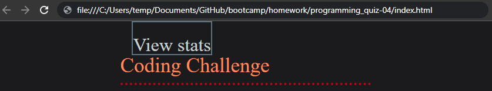
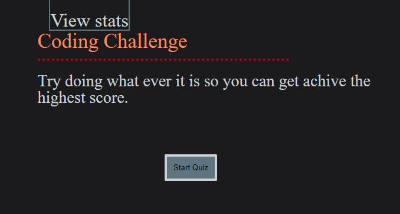
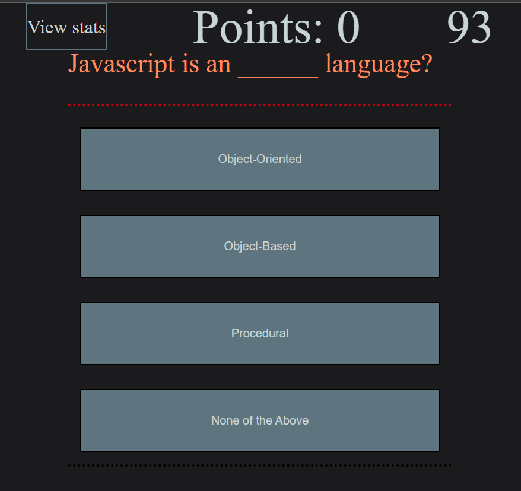
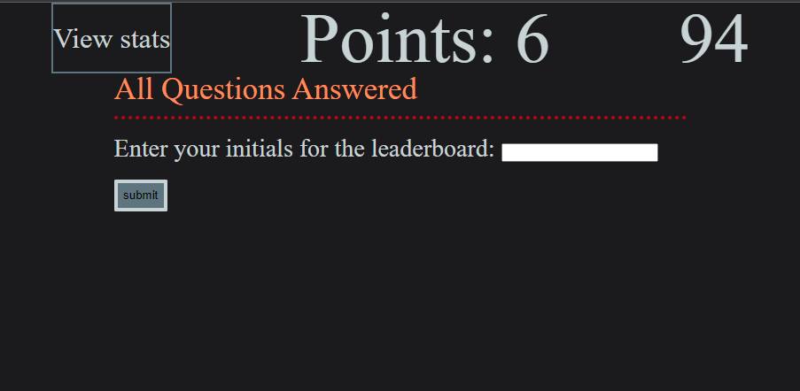
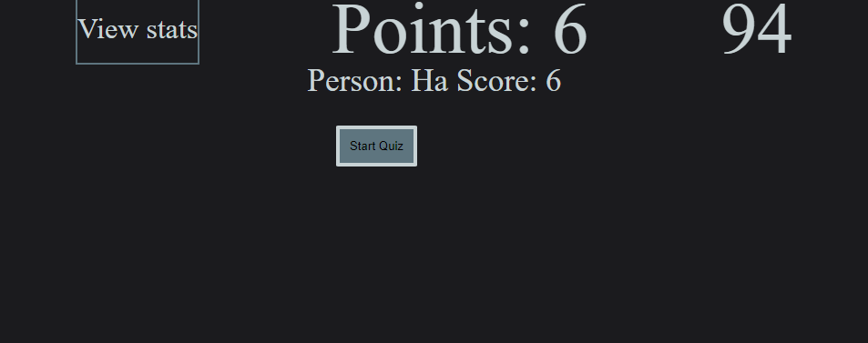
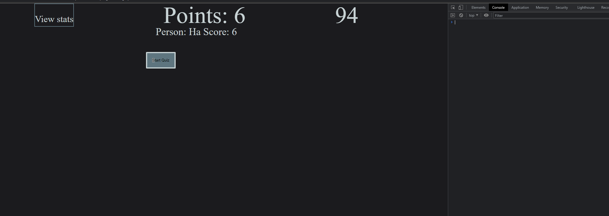
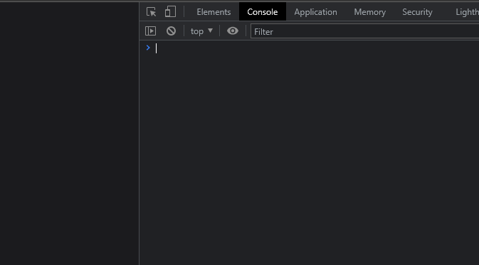
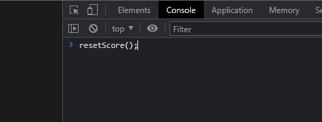
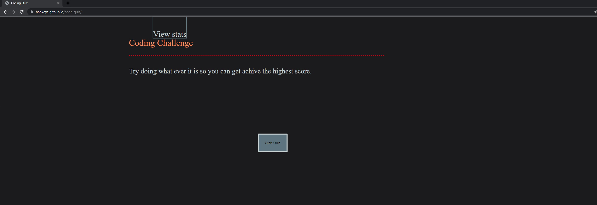

# JavaScript Quiz

## Description

Simple quiz about Javascript written for the most part in Javascript. Only a few questions and not to hard. Mainly done out of practice of skills.

## Table Of Cotents

- [Installation And Usage](#installation)
- [Usage](#Usage)
- [Git Pages](#pages)

## Installation
To get this up and runing simply download the repo. Extract and navigate your browser to the location of the index.html.

## Usage
Very simple to use first navagte to the index.html like shown above.
Next you have two options, you can either start the quiz or view the highscores. Because this will be the first time there will be no scores. So we will procede with option one.

Next answer the questions being prompted.

Finally enter your initials iin the white box. Press submit and you are taking to the scoreboard.

Here you can see the person and their score.

There is a secret command to reset the scoreboard. First hit F12 on your keyboard.

in here if you click console on the top right there and then click nex to that blue chevron.

then type the following seen in the screenshot and hit enter(may have to hit enter twice).

and boom scores have been cleared.

## Pages

If you would like to view this live. Github has this great utility called Gitpages where you can host stuff.
If you click [here](https://hahkeye.github.io/password-generator/)

